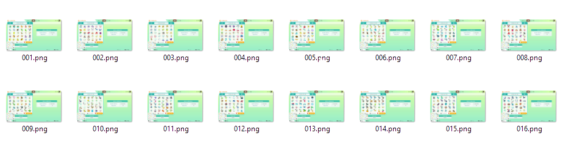

# homedumper

[](https://opensource.org/licenses/MIT)


Computer vision software to automate the process of dumping a Pokemon HOME 
database from a video. 

> 🥚 This project is still in an early stage and some of the
> instructions below may be not yet fully implemented. 

## 1. Installation

Make sure you have the following programs installed and in the `PATH` of your 
system:

* [Python](https://www.python.org/downloads/)
* [Git](https://git-scm.com/downloads) 
* [Tesseract](https://tesseract-ocr.github.io/tessdoc/Installation.html) 

Then, fetch the source code and install software dependencies:

```bash
$ git clone https://github.com/gvieralopez/homedumper.git
$ cd homedumper
$ pip install -r requirements.txt
```

## 2. Usage

You can test the program using the sample video provided with this repository:


### 2.1 Using your own video instead of the default one

If you want to, you can record your own video and place it in the `data` folder. 
Make sure to mimic the one in this repo, paying attention to the following:

1. Place your cursor over `Newest 30` button before start recording.
2. Delete any parts of the video from the begining and the end, that do not contain 
the information of the boxes you want to process

The following step will assume we are using the video from `data/myhome.mp4`,
to apply them to your own video, just use the name of your video instead of
`my_home.mp4`.

### 2.2 Extracting the key frames from your video

The first step of this software is to identify all the independent frames from the video
that capture the status of a HOME box. To do so, simply run:

```bash
$ python -m homedumper extract data/myhome.mp4
```

This will create the following folder structure:

```
    📁output                  
    └── 📁myhome          
        └── 📁frames
            ├── 001.png
            ├── 002.png
            ├── ...
            └── N.png
```

Where the `frames` subfolder should contain all *unique* frames of HOME boxes
found in the video. They should look like this:



> ℹ️ **Pro tips:** 
> 1. If you already have high quality pictures of your HOME boxes (1280 
> x 720), you can create a similar folder structure and proceed with the 
> following step.
> 2. Feel free to delete the images from boxes you don't want to dump to your 
> db (if any) before proceed to the next step.

### 2.3 Reading the content of each box from the key frames

Once you have the frames you want to process, simply run:

```bash
$ python -m homedumper boxify output/myhome
```

This will read each image and extract the box name from it and as many smaller images
as Pokémon where in that box. After running that command, you will have a folder structure
like this one:

```

    📁output                  
    └── 📁myhome          
        └── 📁frames
        │   ├── 001.png
        │   ├── 002.png
        │   ├── ...
        │   └── N.png
        └── 📁boxes
            ├── 📁001
            │   ├── title.txt
            │   ├── 01.png
            │   ├── 02.png
            │   ├── ...
            │   └── 30.png
            ├── 📁002
            │   ├── title.txt
            │   ├── 01.png
            │   ├── 02.png
            │   ├── ...
            │   └── 30.png
            ...
```

Note that all subfolder names inside `boxes` folder correspond to the original 
image names in the `frame` folder. Inside each subfolder there will be a
`title.txt` file with the name of the box in the original Pokemon Home box and
30 `.png` files with the thumbnails of every Pokémon in the box.


### 2.4 Matching the extracted thumbnails with actual Pokémon data

[Comming soon]

## 3. Disclaimer

This software comes bundled with data and graphics extracted from the Pokémon 
series of video games. Some terminology from the Pokémon franchise is also 
necessarily used within the software itself. This is all the intellectual 
property of Nintendo, Creatures, inc., and GAME FREAK, inc. and is protected by 
various copyrights and trademarks.

The authors believe that the use of this intellectual property for a fan 
reference is covered by fair use and that the software is significantly 
impaired without said property included. Any use of this copyrighted property 
is at your own legal risk.

This software is not affiliated in any way with Nintendo, Pokémon or any other 
game company.
