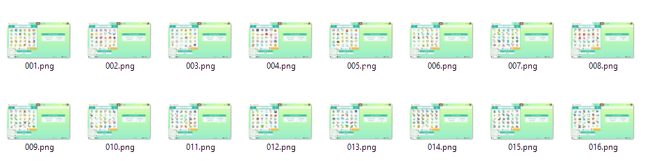

# homedumper

homedumper is a computer vision software to automate the process of dumping a 
Pokemon HOME database from a video. 

This file is an step-by-step explanation of its functioning. If you are looking 
for a quick out-of-the-box instructions see [README.md](README.md) instead.

If you want to understand every step in the process, and maybe tweak some 
intermediate results, let's keep going.

## 1. Requirements

* You will need to install the software following the instructions in the 
[README.md](README.md).
* You will need a screen recording of Pokemon Home boxes (there is a sample 
video provided with this repository in `data/myhome.mp4`

## 2 Using your own video instead of the default one

You can record your own video and place it in the `data` folder. 
Make sure to mimic this one:


paying attention to the following:

1. Place your cursor over `Newest 30` button before start recording.
2. Delete any parts of the video from the begining and the end, that do not 
contain the information of the boxes you want to process

The following steps will assume we are using the video from `data/myhome.mp4`,
to apply them to your own video, just use the name of your own video instead of
`myhome` on every occurence.

## 3. Extracting key frames from your video

The first step of this software is to identify all the independent frames from 
the video that capture the status of a HOME box. To do so, simply run:

```bash
$ python -m homedumper extract data/myhome.mp4
```

This will create the following folder structure:

```
    📁output                  
    └── 📁myhome          
        └── 📁frames
            ├── 001.png
            ├── 002.png
            ├── ...
            └── N.png
```

Where the `frames` subfolder should contain all *unique* frames of HOME boxes
found in the video. They should look like this:



> ℹ️ **Pro tips:** 
> 1. If you already have high quality pictures of your HOME boxes (1280 
> x 720), you can create a similar folder structure and proceed with the 
> following step.
> 2. Feel free to delete the images from boxes you don't want to dump to your 
> db (if any) before proceed to the next step.

## 4. Reading the content of each box found in the key frames

Once you have the frames you want to process, simply run:

```bash
$ python -m homedumper boxify output/myhome
```

This will read each image and extract the box name from it and as many smaller 
images as Pokémon were in that box. After running that command, you will end up
with a folder structure like this one:

```

    📁output                  
    └── 📁myhome          
        └── 📁frames
        │   ├── 001.png
        │   ├── 002.png
        │   ├── ...
        │   └── N.png
        └── 📁boxes
            ├── 📁001
            │   ├── title.txt
            │   ├── 01.png
            │   ├── 02.png
            │   ├── ...
            │   └── 30.png
            ├── 📁002
            │   ├── title.txt
            │   ├── 01.png
            │   ├── 02.png
            │   ├── ...
            │   └── 30.png
            ...
```

Note that all subfolder names inside `boxes` folder correspond to the original 
image names in the `frame` folder. Inside each subfolder there will be a
`title.txt` file with the name of the box in the original Pokemon Home box and
30 `.png` files with the thumbnails of every Pokémon in the box.

## 5. Downloading the database of pokemon thumbnails

This step is required to be able to match our extracted pokemon thumbnails with
every possible candidate. To download the db run:

```bash
$ python -m homedumper download
```

## 6. Matching the extracted thumbnails with actual Pokémon data

Finally, to match every thumbnail execute:

```bash
$ python -m homedumper match output/myhome
```

This will generate a `match.csv` file with the results in `output/myhome` that will
look like this one:

| Box name  | Slot Number   | Pokémon ID  |
| --------- | ------------- | ----------- |
| Home 001  |      01       |  bulbasaur  |
| Home 001  |      02       |  ivysaur    |
|     ...   |     ...       |    ...      |
| Home 015  |      30       |  zarurde    |


## 7. What is next?

Current results are far from perfect. Hopefully with your help we can identify
or solve problems in the matching process. For a full list of pending issues
in this project check [TODO.md](TODO.md).